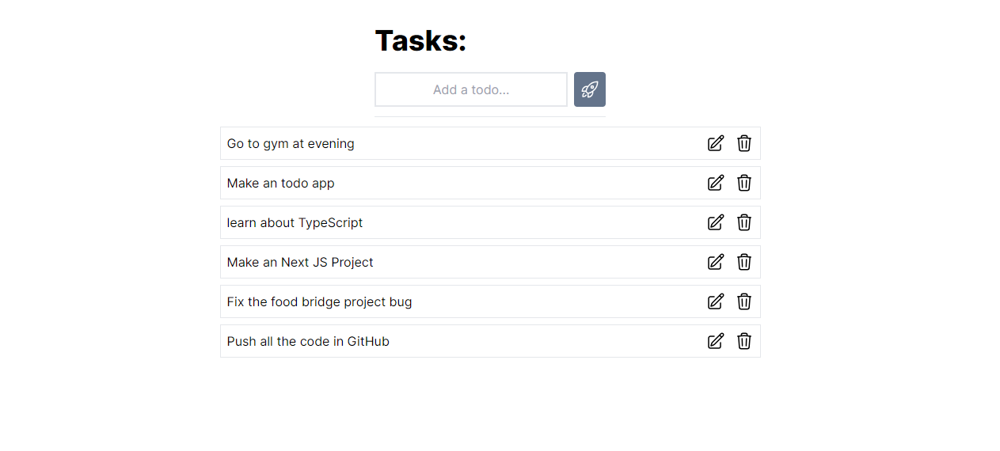

# Full Stack Todo App

This is a basic full stack todo app built using React for the frontend, Node.js with Express for the backend, and MongoDB for the database.

## Features
- Create, read, update, and delete todos.
- Store todos in a MongoDB database.
- Simple and intuitive user interface.

## Technologies Used
- Frontend: React
- Backend: Node.js, Express
- Database: MongoDB

## Usage

1. Clone the repository:
   ```bash
   git clone https://github.com/sidhrthh/todo-app

## Play with the App
Feel free to play around with the app, add some todos, mark them as completed, update them, or delete them. Experience the simplicity and effectiveness of this todo app!

## Preview




